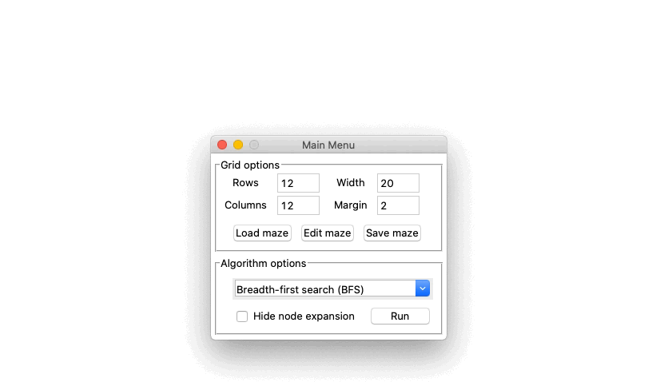

# Pathfinding Algorithms
Collection of pathfinding algorithms implemented in python using `Tkinter` and `Pygame` as graphical interfaces.

<p align="center">
    
</p>

## Installation

To install the dependencies, run the following command:

```bash
pip install -r requirements.txt
```

If using Conda, you can also create an environment with the requirements:

```bash
conda env create -f environment.yml
```

By default the environment name is `pathfinding-algorithms`. To activate it run:

```bash
conda activate pathfinding-algorithms
```


## Usage

Display the menu using the following command:

```python
python -m pathfinding_algorithms
```